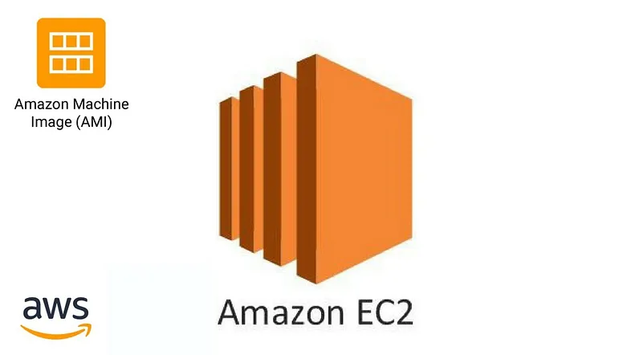
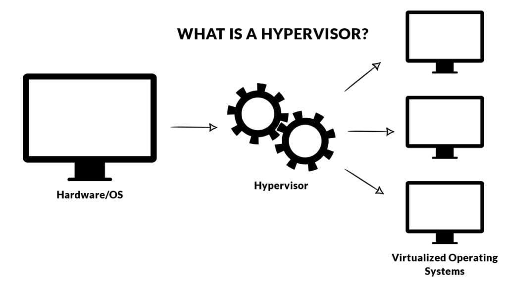
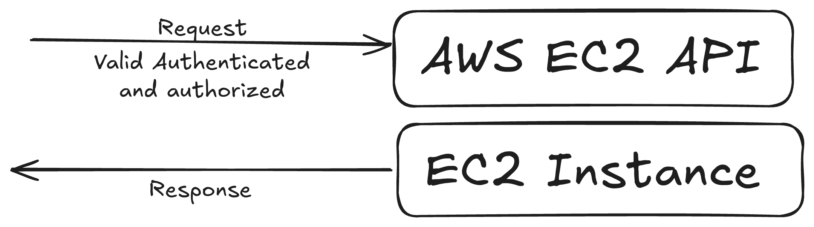
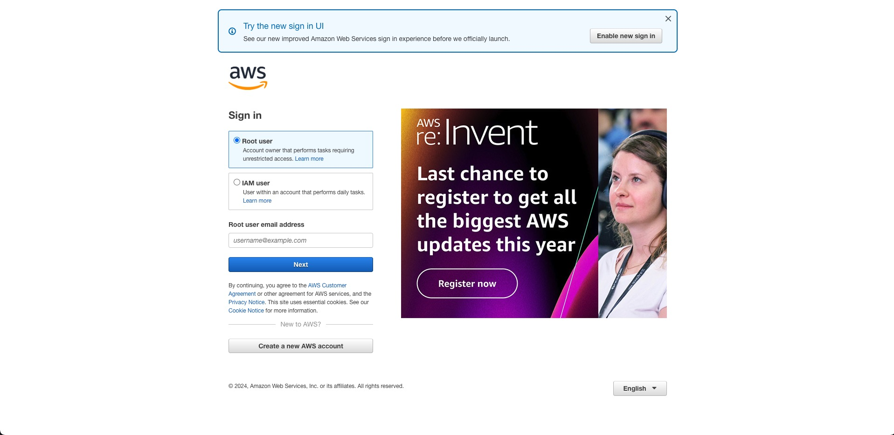
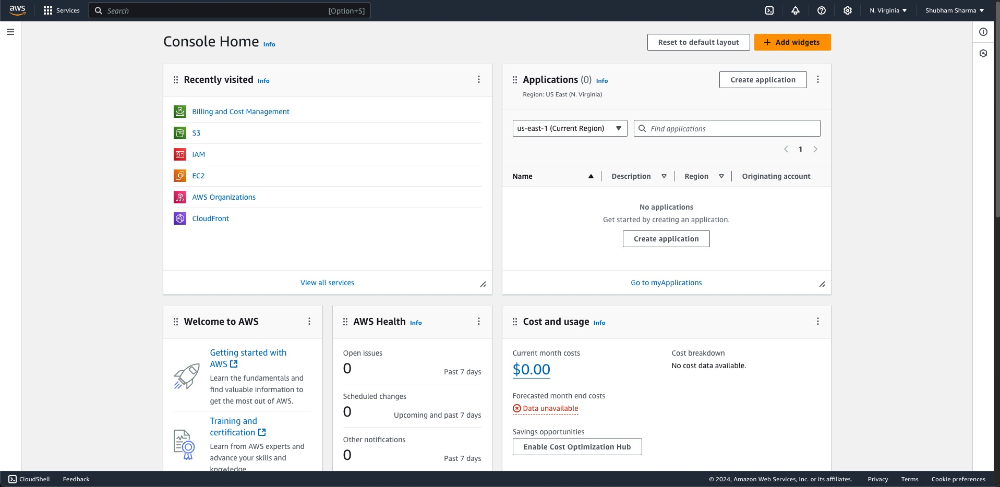
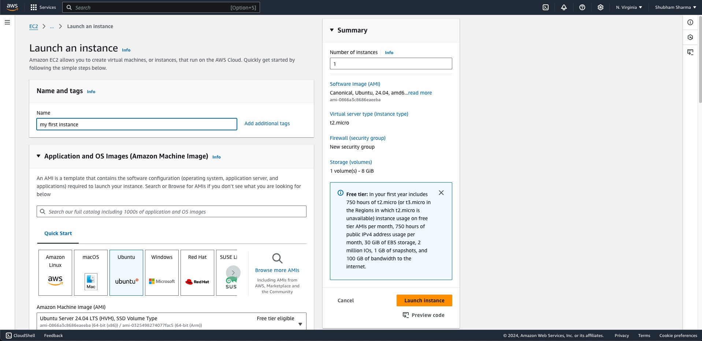
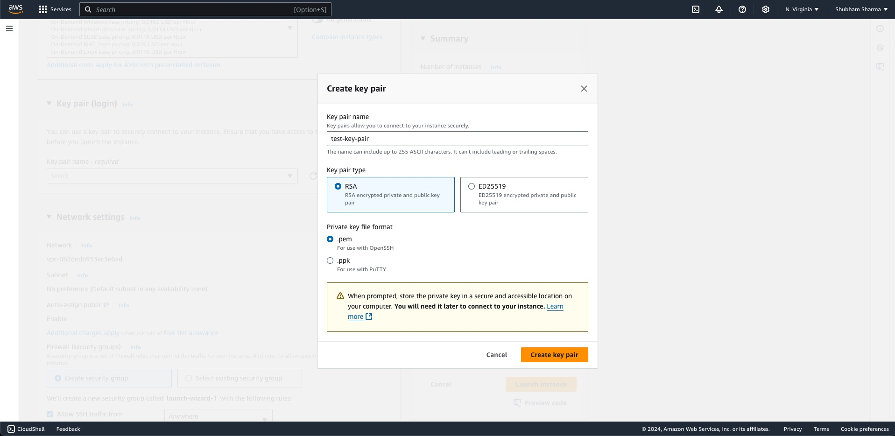
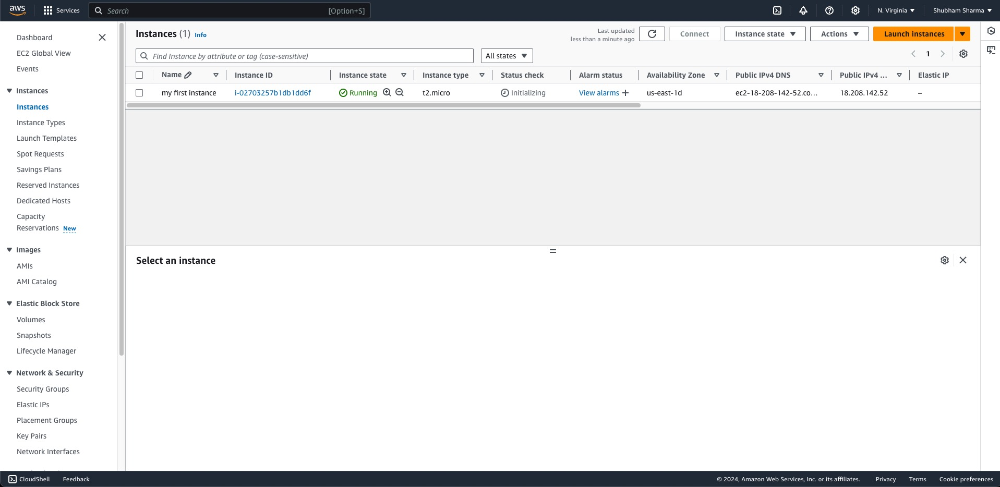
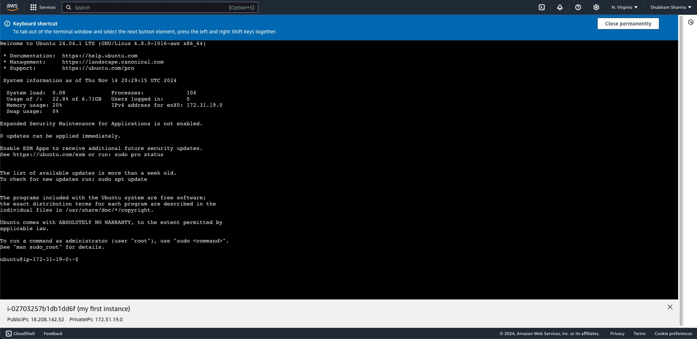
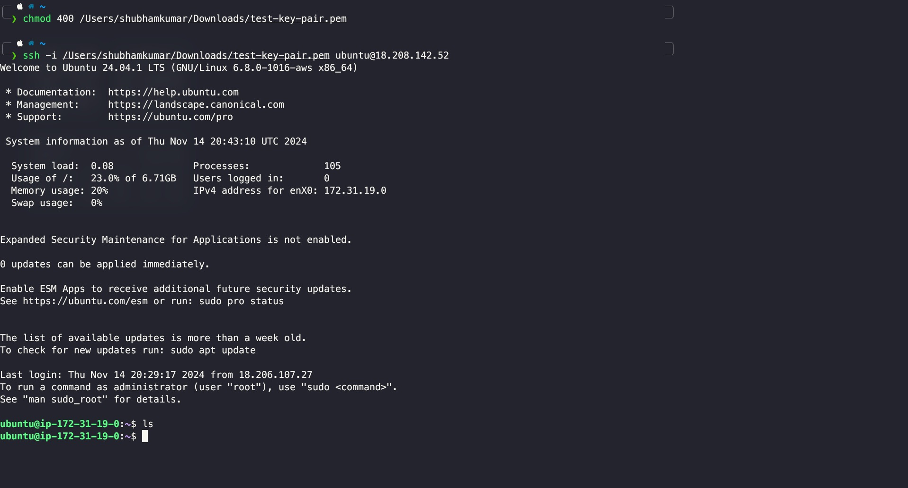

# Unleash the Power of Virtual Machines and Hypervisors in DevOps

In the world of DevOps, the efficient management of resources is the main concern.
This is where Virtual Machines (VMs) and hypervisors come into the picture, changing how organizations optimize their computing capabilities. Imagine a very big plot of land, where a single house is built, occupying only a small area. This analogy perfectly matches the role of VMs in the DevOps landscape.

## Understanding the Virtual Machines

That single house on the vast piece of land is an example of an underutilized resource, and traditional physical servers frequently end up in a similar situation.
Usually, businesses would assign a specific server to each team or application, which resulted in a major underutilization of the hardware's potential.

On the other hand, virtual machines provide a revolutionary answer to this problem.
VMs allow businesses to optimize the use of their computer resources by logically dividing a single physical server into several separate virtual environments.
It would be like building several separate, smaller homes on that large piece of land, each one customized to meet the needs of its occupants.


## The Hypervisor: The Mastermind Behind Virtual Machines

The hypervisor, an advanced software layer that builds and controls virtual machines on a physical server, is essential to this smooth virtualization. Consider the hypervisor to be the estate manager, carefully monitoring the distribution and use of the land to make sure every virtual "dwelling" (VM) has access to the resources it needs without interfering with the others.

Well-known hypervisors like VMware and Xen enable businesses to divide hardware so that several users or apps can use it without any problems. The foundation of DevOps processes, where the capacity to grow resources on demand is crucial, is this degree of control and flexibility.


## Clouds, VMs, and the Art of Efficient Resource Management

Cloud platforms, like AWS, Azure, and Google Cloud, have embraced the power of VMs to revolutionize their infrastructure. These cloud giants leverage vast data centres, each housing numerous physical servers across various regions. When a user requests a VM (or an EC2 instance on AWS), the cloud provider's systems spring into action, selecting an optimal physical server, creating a VM using a hypervisor, and allocating the requested resources to the virtual environment.

This logical separation of physical hardware and virtual resources is the key to unlocking exceptional efficiency. Just as our analogy of the expansive plot of land can be transformed into a thriving community of smaller, specialized dwellings, cloud providers can now serve millions of users across fewer physical servers, a vast improvement over the traditional one-server-per-user approach.

## Unleashing the Full Potential of VMs in DevOps

As you go deeper into DevOps, understanding the intricacies of Virtual Machines and hypervisors will be instrumental in your journey. These technologies empower organizations to optimize resource utilization, scale infrastructure on-demand, and create agile, responsive computing environments – all essential pillars of successful DevOps practices.

By embracing the power of VMs and hypervisors, DevOps practitioners can unlock new levels of efficiency, flexibility, and adaptability, positioning their organizations for success in the ever-evolving digital landscape.

## Getting started with a Virtual Machine(VM)

Since there are many cloud providers available nowadays, for example, **AWS** from Amazon, **Azure** from MicroSoft, **Google Cloud Provider** from Google, etc.
But here in the blog, we will be using AWS, and all the steps which I will show you will be applicable for others too.

### EC2

The full form of **EC2** is **Elastic Compute Cloud**. It's not a buzz word, it just a name given to the Virtual Machine provided by **AWS**.

### Important of Automation in cloud

Before starting a **EC2** instance, I would like to first tell you what is the importance of Automation in Cloud

- It will be quite simple to establish a single virtual machine. All you have to do is open the cloud provider of your choice. After that, all you have to do is enter some settings and hit a button to get your virtual machine started.
- But imagine if you want to create 1000's of virtual machine, this process will become very much tidious. And here you need automation else if you choose to do it manually, it will takes weeks to just start 1000's of virtual mahines.
- This automation can be done in multiple ways, for **AWS EC2**, we can use it's API and then we can write a script and make a API call to AWS EC2 API.
  
- Other ways to start **AWS EC2** are
  - AWS CLI
  - AWS API (Boto3 if you want to use Python)
  - AWS CFT(Cloud Formation Template)
  - AWS CDK
  - Terraform
    - Though it is not specific to AWS. But you can also use it to start **AWS EC2** instance. People use it for hybrid cloud model. I will write a Blog on **Terraform** soon.

## Starting your first EC2 Instance

- First step is to visit [AWS console page](https://aws.amazon.com/console/), then go to **sign-in** page.
  
- If you have an AWS account already then login with your credentials.
- If you don't have an account, please create one. It is very easy to create an account, it will ask some basic details like email, password but It will also ask for your **credit card** details,
  don't worry it won't cost you util are you not using any paid services
- After login you will see this interface
  
- Then go to **EC2**, you can either search it or directly click on the **EC2** written text
- Now, click on the **Launch Instance**. So, we are going to start a **ubuntu** machine, for this just fill the basic details like instance name, then choose **Ubuntu** in application and OS Images section
- Below this you can choose intance type, for now I will suggest you to choose _t2.micro_ which is a free tier server
  
- Then, generate a key pair and save it to your laptop. This will be used to login to your **ubuntu server** from you own computer
  
  > Note: Do not share it with anyone.
- The next step is to click on **Launch Instance** button, and your are good to go
- Last step is to visit the ec2 **instances** page from side panel to see your running instance
  
- Congratulations 🎉, You have started your first ec2 instance

## Connecting to your EC2 instance

In this section of blog, I will show you how can you connect your **ec2** instance in two different ways

### The easier way

- In the instances pages, click on the **instance id** of your ec2 instance
- Now, after that, in the top right of the screen you can see a **Connect** button, click on that
- You will be redirected to a different screen, so now again click on **Connect**
- You can now see a console in your browser, which is called aws console. If you can see it, means you have successfully connected to your EC2 Instance
  
- Now you can write your linux commands

### The better way

- Open any terminal of your choice on your computer
- Change the file permission of the key-value-pair-pem file

```bash
chmod 400 /path/to/your/key-value-pair-pem-file.pem
```

this command will change the permission of the file, so that only owner can read it, and no one else can read/edit it

- Now go to you ec2 instance and copy the public IPv4 address and run the below command

```bash
ssh -i /path/to/your/key-value-pair-pem-file.pem ubuntu@public-ip-of-your-ec2
```

- For the first time, SSH asks you if you want to continue the connection (yes/no/[fingerprint]). Typing “yes” accepts the key, telling SSH that you trust the server, so please type yes
  
- Congrats🎊, you have successfully connected your computer to a ec2 instance

If you'd like to connect and learn together, you can find me on [LinkedIn](https://www.linkedin.com/in/shubhamku044/) and [Twitter](https://x.com/shubhamku044). Let's help each other grow! 🚀

Thank you for reading this article! I would love to hear your thoughts and experiences with DevOps in the comments below. Did you find this helpful? What aspects of DevOps would you like to learn more about? Drop a comment and let's discuss! 💭
Your feedback helps me create better content for the community. 🙏
